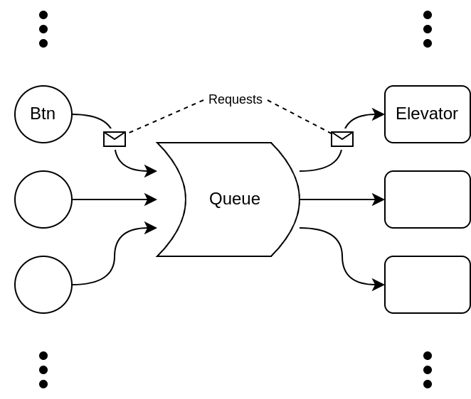

# Simple Elevator Simulation

Simple elevator logic simulator based on the producer/consumer paradigm.



One thread spawns requests for an elevator with a source floor and a
destination.

A second thread consumes the requests and assigns it to the most appropriate
elevator. Each elevator then processes their queue moving from floor to floor.


## Quick Start

 - Python
   ```
   ./main.py
   ```
 - C++
   ```
   g++ -o main *.cpp
   ./main
   ```
